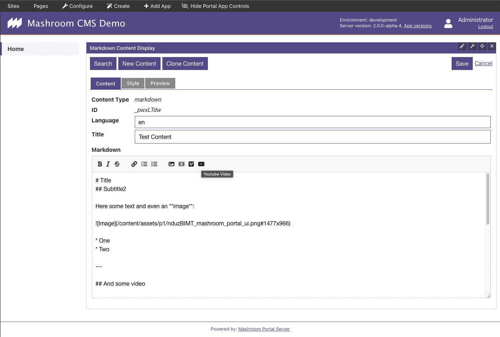

# Mashroom Content

Content (CMS) plugins for [Mashroom Server](https://www.mashroom-server.com).

## Features

 * Brings an [API abstraction](packages/mashroom-content-api/README.md) that allows you to retrieve and manage content from a Headless CMS
 * The content services can be used on the server side and on the client side in *Microfrontends* (Portal Apps)
 * Allows it to transparently switch the Headless CMS/Content Provider
 * Includes two read-to-use content providers:
     * One that [uses the internal _Mashroom Storage_](packages/mashroom-content-provider-internal-storage/README.md)
     * One for [Strapi Headless CMS](packages/mashroom-content-provider-strapi/README.md)
 * Automatic image proxying with optimizations (format conversion and resizing on-the-fly)
 * CDN integration
 * Comes with a [_Media Library App_](packages/mashroom-content-provider-strapi/README.md),
   which allows it to browse and manage your assets such as images and videos.
   It can also be used by other Apps to select assets.
 * Includes a [Markdown Renderer App](packages/mashroom-content-markdown-renderer-app/README.md) with the following features:
     * Images are automatically optimized for the target devices (and converted to webp/avif if possible)
     * Server-side rendering for SEO
     * Simple integration of Videos from the local media library, Youtube or Vimeo
     * Extra CSS per instance which will only be applied to the content




## Requirements

 * Node >= 14
 * **Mashroom 2.x**

## Usage

Add at least the following packages to dependencies for _Mashroom_ server:

 * @mashroom-content/mashroom-content-api
 * @mashroom-content/mashroom-content-asset-processing
 * @mashroom-content/mashroom-content-provider-internal-storage
 * @mashroom-content/mashroom-content-markdown-renderer-app
 * @mashroom-content/mashroom-content-media-library-app

If you want to use the internal storage to save content add the following to your _Mashroom_ config file:

```json
{
    "plugins": {
        "Mashroom Content Services": {
            "provider": "Mashroom Content Internal Storage Provider",
            "cacheEnable": true,
            "cacheTTLSec": 1800
        },
        "Mashroom Content Asset Processing Services": {
            "scaleUp": false,
            "defaultQuality": 75,
            "cacheEnable": true,
            "cacheDefaultTTLSec": 31536000,
            "cacheFolder": "./data/asset-proc-cache"
        },
        "Mashroom Content Internal Storage Provider": {
            "assetsFolder": "./data/assets"
        }
    }
}
```

### Strapi

To use Strapi 4.x as content provider add

 * @mashroom-content/mashroom-content-provider-strapi

to your dependencies and use a config like this:

```json
{
    "plugins": {
        "Mashroom Content Services": {
            "provider": "Mashroom Content Strapi Provider",
            "cacheEnable": true,
            "cacheTTLSec": 1800
        },
        "Mashroom Content Asset Processing Services": {
            "scaleUp": false,
            "defaultQuality": 75,
            "cacheEnable": true,
            "cacheDefaultTTLSec": 31536000,
            "cacheFolder": "./data/asset-proc-cache"
        },
        "Mashroom Content Strapi Provider": {
            "strapiUrl": "http://localhost:1337",
            "apiToken": "xxxxxxx"
        }
    }
}
```

Your Strapi instance needs at least an activated Internationalization Plugin with the same languages as configured in _Mashroom_

Also, if you want to use the _Markdown Renderer App_ you need to create a content type _markdown_ with two properties: _title_ (string), _content_ (rich text).

## Development

For development Node.js >= 16 is required.

After cloning the repository just run

    npm run setup

to install all dependencies.

To start the test server:

    cd packages/test/test-server1
    npm start

The test server will be available at http://localhost:5050

To load some test data call: http://localhost:5050/initContent
To login, enter: http://localhost:5050/login

