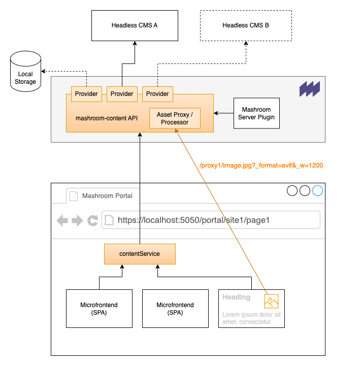

# Mashroom Content

Content (CMS) plugins for [Mashroom Server](https://www.mashroom-server.com).

It provides an API abstraction for plugins on the server-side and Microfrontends (SPAs) on the client-side to easily retrieve and
update content from a Headless CMS. The actual Headless CMS backend can transparently be exchanged.

At the moment it consists of:

 * A [Content API](packages/mashroom-content-api/README.md) that allows you to retrieve and manage content from a Headless CMS
   in Mashroom plugins (e.g. Portal Apps). The Headless CMS/Content Provider can transparently be switched.
 * A [Media Library App](packages/mashroom-content-media-library-app/README.md)
   which allows it to browse and manage your assets such as images and videos.
   It can also be used by custom Apps to lookup assets.
 * A [Markdown Display App](packages/mashroom-content-markdown-renderer-app/README.md) which renders Markdown content
   and also provides the possibility to update/create content directly as Administrator.
   This is more like a *demo* how the Content API can be used.
 * A [provider](packages/mashroom-content-provider-internal-storage/README.md) that uses the internal Mashroom storage as backend
 * A [provider](packages/mashroom-content-provider-strapi/README.md) for the [strapi Headless CMS](https://strapi.io).

## Architecture



## Requirements

 * Node >= 14
 * **Mashroom 2.x**

## Basic Usage

Add the following packages to dependencies for _Mashroom_ server:

 * @mashroom-content/mashroom-content-api
 * @mashroom-content/mashroom-content-asset-processing
 * @mashroom-content/mashroom-content-provider-internal-storage
 * @mashroom-content/mashroom-content-media-library-app
 * @mashroom-content/mashroom-content-markdown-renderer-app

And add it to the plugin lookup path in the server config:

```json
{
    "pluginPackageFolders": [
        {
            "path": "./node_modules/@mashroom"
        },
        {
            "path": "./node_modules/@mashroom-content"
        }
    ]
}
```

And configure the plugins like this to use the internal storage:

```json
{
    "plugins": {
        "Mashroom Content Services": {
            "provider": "Mashroom Content Internal Storage Provider",
            "cacheEnable": true,
            "cacheTTLSec": 1800
        },
        "Mashroom Content Asset Processing Services": {
            "scaleUp": false,
            "defaultQuality": 75,
            "cacheEnable": true,
            "cacheDefaultTTLSec": 31536000,
            "cacheFolder": "./data/asset-proc-cache"
        },
        "Mashroom Content Internal Storage Provider": {
            "assetsFolder": "./data/assets"
        }
    }
}
```

Now you can use the API on the server-side like this:

```typescript
  const contentService: MashroomContentService = req.pluginContext.services.content.service;
  const {data} = await contentService.getContent<any>(req, 'my-stuff', '1234567');
```

And on the client-side like this:

```typescript
const bootstrap: MashroomPortalAppPluginBootstrapFunction = async (portalAppHostElement, portalAppSetup, clientServices) => {
    const contentService: MashroomContentClientService = clientServices.contentService;

    const {data} = await contentService.getContent<any>('my-stuff', '1234567');

    // ...
}
```

And you can add the *Markdown Display* App to any page to display some content there:


### Other Content Providers

To switch the provider just change the *provider* property of the *Mashroom Content Services* plugin.

For example for the [Strapi Provider](packages/mashroom-content-provider-strapi/README.md) just add the plugin:

 * @mashroom-content/mashroom-content-provider-strapi

and update the config like this:

```json
{
    "plugins": {
        "Mashroom Content Services": {
            "provider": "Mashroom Content Strapi Provider",
            "cacheEnable": true,
            "cacheTTLSec": 1800
        },
        "Mashroom Content Strapi Provider": {
            "strapiUrl": "http://localhost:1337",
            "apiToken": "xxxxxxx"
        }
    }
}
```

## Development

For development Node.js >= 16 is required.

After cloning the repository just run

    npm run setup

to install all dependencies.

To start the test server:

    cd packages/test/test-server1
    npm start

The test server will be available at http://localhost:5050

To load some test data call: http://localhost:5050/initContent
To login, enter: http://localhost:5050/login - the Administrator credentials are admin/admin

