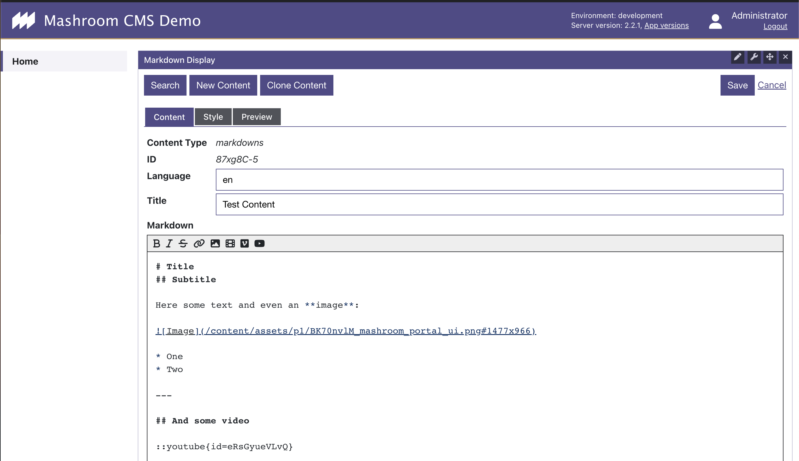
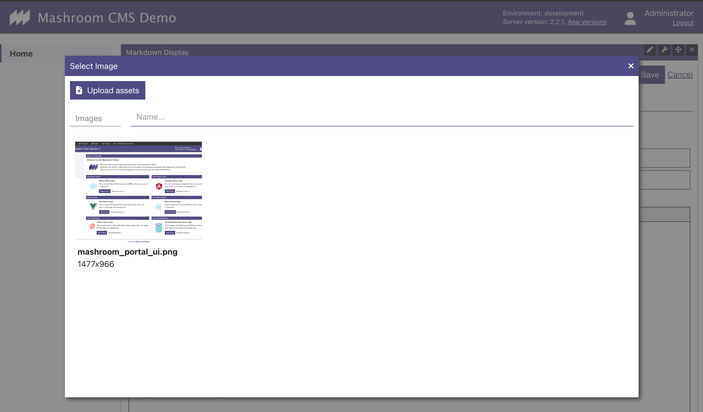

# Mashroom Content

Content (CMS) plugins for [Mashroom Server](https://www.mashroom-server.com).

At the moment it consists of three parts:

 * A [Content API](packages/mashroom-content-api/README.md) that allows you to retrieve and manage content from a Headless CMS.
   The Headless CMS/Content Provider can transparently be switched.
 * A [Media Library App](packages/mashroom-content-provider-strapi/README.md),
   which allows it to browse and manage your assets such as images and videos.
   It can also be used by custom Apps to lookup assets.
 * A demo [Markdown Renderer App](packages/mashroom-content-markdown-renderer-app/README.md) that shows how the Content API
   can be used to manage content and how the Media Library App can be integrated.

## Requirements

 * Node >= 14
 * **Mashroom 2.x**

## Basic Usage

Install the following packages to dependencies for _Mashroom_ server:

 * @mashroom-content/mashroom-content-api
 * @mashroom-content/mashroom-content-asset-processing
 * @mashroom-content/mashroom-content-provider-internal-storage
 * @mashroom-content/mashroom-content-media-library-app
 * @mashroom-content/mashroom-content-markdown-renderer-app

And configure the plugins like this to use the internal storage:

```json
{
    "plugins": {
        "Mashroom Content Services": {
            "provider": "Mashroom Content Internal Storage Provider",
            "cacheEnable": true,
            "cacheTTLSec": 1800
        },
        "Mashroom Content Asset Processing Services": {
            "scaleUp": false,
            "defaultQuality": 75,
            "cacheEnable": true,
            "cacheDefaultTTLSec": 31536000,
            "cacheFolder": "./data/asset-proc-cache"
        },
        "Mashroom Content Internal Storage Provider": {
            "assetsFolder": "./data/assets"
        }
    }
}
```

ow you can use the API on the server-side like this:

```typescript
  const contentService: MashroomContentService = req.pluginContext.services.content.service;
  const {data} = await contentService.getContent<any>(req, 'my-stuff', '1234567');
```

And on the client-side like this:

```typescript
const bootstrap: MashroomPortalAppPluginBootstrapFunction = async (portalAppHostElement, portalAppSetup, clientServices) => {
    const contentService: MashroomContentClientService = clientServices.contentService;

    const {data} = await contentService.getContent<any>('my-stuff', '1234567');

    // ...
}
```

And you can add the *Markdown Display* App to any page and show come content there:





### Strapi

To use Strapi 4.x as content provider add

 * @mashroom-content/mashroom-content-provider-strapi

to your dependencies and use a config like this:

```json
{
    "plugins": {
        "Mashroom Content Services": {
            "provider": "Mashroom Content Strapi Provider",
            "cacheEnable": true,
            "cacheTTLSec": 1800
        },
        "Mashroom Content Asset Processing Services": {
            "scaleUp": false,
            "defaultQuality": 75,
            "cacheEnable": true,
            "cacheDefaultTTLSec": 31536000,
            "cacheFolder": "./data/asset-proc-cache"
        },
        "Mashroom Content Strapi Provider": {
            "strapiUrl": "http://localhost:1337",
            "apiToken": "xxxxxxx"
        }
    }
}
```

Your Strapi instance needs at least an activated Internationalization Plugin with the same languages as configured in _Mashroom_

Also, if you want to use the _Markdown Renderer App_ you need to create a content type _markdown_ with two properties: _title_ (string), _content_ (rich text).

## Development

For development Node.js >= 16 is required.

After cloning the repository just run

    npm run setup

to install all dependencies.

To start the test server:

    cd packages/test/test-server1
    npm start

The test server will be available at http://localhost:5050

To load some test data call: http://localhost:5050/initContent
To login, enter: http://localhost:5050/login - the Administrator credentials are admin/admin

